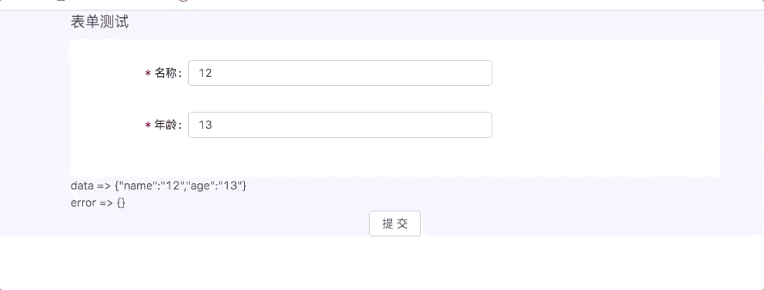

## IND

### 基础配置

```javascript
class App extends React.Component<IAppProps> {
  state = {
    formError: {},
    formData: {},
    formSchema: {
      name: {
        type: "string",
        label: "名称",
        placeholder: "请填写名称",
        validate: { maxLen: 3, required: true },
      },
    }
  }
  onChange = () => {}
  handleSubmit = () => {}
  public render() {
    const { formSchema, formData, formError } = this.state
    return (
      <Form
        formSchema={formSchema}
        formData={formData}
        formError={formError}
        onChange={this.onChange}
        onSubmit={this.handleSubmit}
      />
    )
  }
```




### 自定义组件

### API

| 属性       | 说明     | 类型   | 默认值   |
| ---------- | -------- | ------ | -------- |
| formSchema | 表单配置 | object | required |
| formData   | 表单数据 | object | -        |
| formError  | 表单错误 | object | -        |
| onChange   | onChange | event  | -        |
| onSubmit   | onSubmit | event  | -        |
